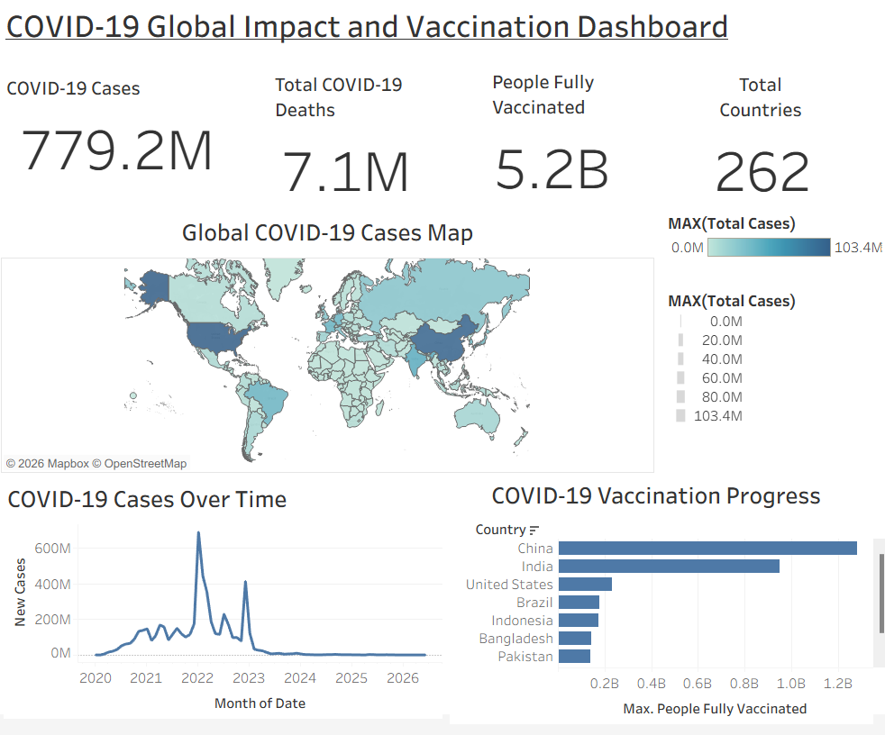

# 🌍 COVID-19 Global Analysis | SQL • Tableau

## Project Overview

This project analyzes global COVID-19 data to explore the impact of the pandemic across countries, continents, and vaccination progress.

The analysis focuses on identifying countries with the highest reported cases, understanding global case distribution, and exploring vaccination patterns using SQL for data preparation and Tableau for visualization.

## Dataset

**Source:** Our World in Data - COVID-19 Dataset

The dataset contains global COVID-19 statistics including:
- Total cases
- New cases
- Total deaths
- Vaccination data
- Population information
- Country and continent details

## Tools Used

- **SQL (MySQL)** — Data cleaning, transformation, and analysis
- **Tableau** — Dashboard development and visualization

## Project Workflow

### 1. Data Preparation (SQL)
- Imported COVID-19 dataset into MySQL
- Cleaned and validated data
- Removed unnecessary aggregated records
- Prepared analysis tables for visualization

### 2. Data Analysis
Key metrics analyzed:
- Total COVID-19 cases
- Total deaths
- Countries affected
- Fully vaccinated population
- Country-level comparisons

### 3. Dashboard Development (Tableau)

The dashboard includes:

- 📌 KPI cards for overall pandemic statistics
- 🌍 Global COVID-19 cases distribution map
- 📊 Top 10 countries by total cases
- 💉 Top 10 countries by fully vaccinated population

## Key Insights

- COVID-19 affected hundreds of countries worldwide.
- A small number of countries accounted for a large proportion of reported cases.
- Vaccination levels varied significantly across countries.

## Dashboard Preview

## Repository Structure
